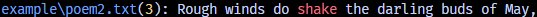

## sniff (sn)
sniff is just a personal grep-like project that I wanted to make, nothing serious.  
I don't see this every becoming used, I just wanted to write some **Rust** code.

### Usage
To search a file such as this poem here **(poem.txt)**:  
```
Shall I compare thee to a summer's day?  
Thou art more lovely and more temperate.  
Rough winds do shake the darling buds of May,  
And summer's lease hath all too short a date.
```
For the word *shake*, we can run
```
> sn shake poem.txt
poem.txt(3): Rough winds do shake the darling buds of May,
```
  
By default, sniff searches recursively, which means the program will look through the whole directory unless the path specified is a file:
```
> sn shake poems
poems\poem.txt(3): Rough winds do shake the darling buds of May,

```
  
If the path flag is omitted, sniff will automatically search the working directory, '**.**':

```
> sn temperate
.\poem.txt(2): Thou art more lovely and more temperate.
.\poems\poem.txt(2): Thou art more lovely and more temperate.
.\README.md(9): Thou art more lovely and more temperate.
.\README.md(29): > sn temperate

```
If your console supports color, the output will be colored with the pattern highlighted in red:  


### Flags
- --no-recursive | -R: Disables recursive searching.
- --ignore-case | -i: Makes the search case-insensitive.
- --max | -m: The maximum amount of matches to show.

